# ⚡ Pulsar Chat System

> Apache Pulsar 기반 실시간 메시징 시스템  
> Spring Boot · Vue.js (Spring 내장 서빙) · Flutter · MinIO

---

## 📸 주요 화면 및 스크린샷

<details open>
  <summary>스크린샷 보기 (클릭하여 접기/펴기)</summary>
  <br/>

  <table>
    <tr>
      <td align="center"><b>01. 관리자 대시보드</b><br/>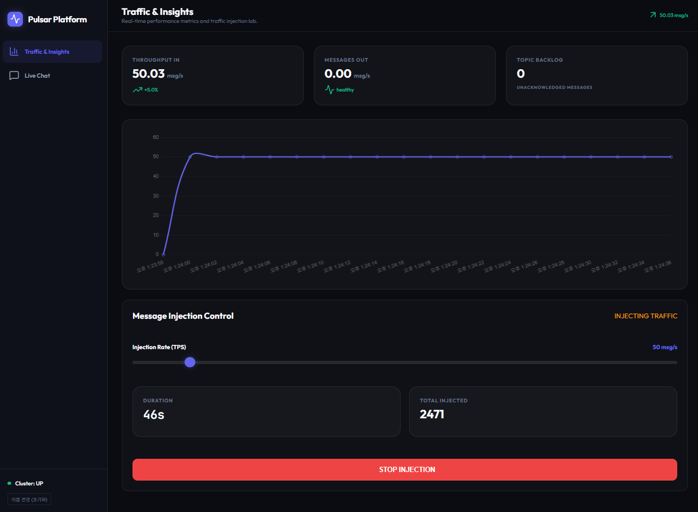</td>
      <td align="center"><b>02. 실시간 라이브 채팅</b><br/>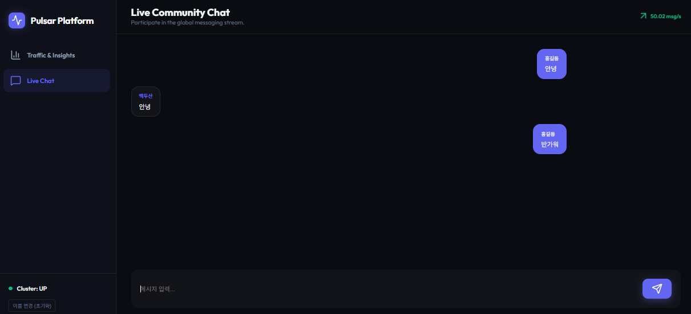</td>
    </tr>
    <tr>
      <td align="center"><b>03. Pulsar Tenants 관리</b><br/>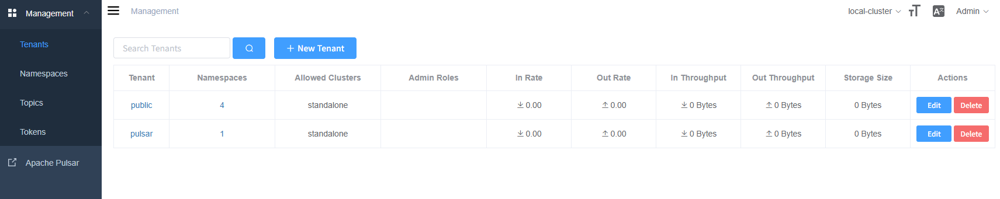</td>
      <td align="center"><b>04. Pulsar Namespaces</b><br/>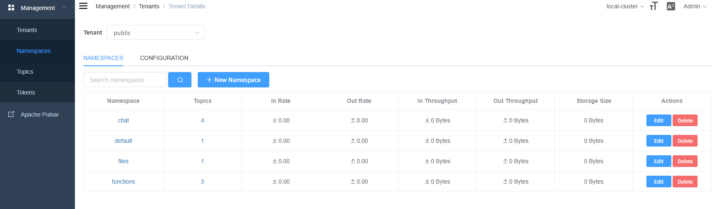</td>
    </tr>
    <tr>
      <td align="center"><b>05. Pulsar Topics 상세</b><br/>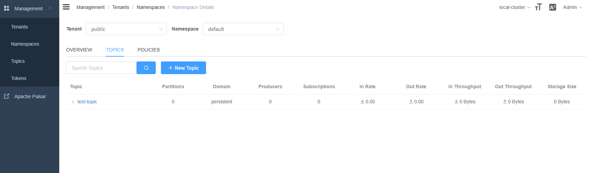</td>
      <td align="center"><b>06. Flutter 모바일 앱</b><br/>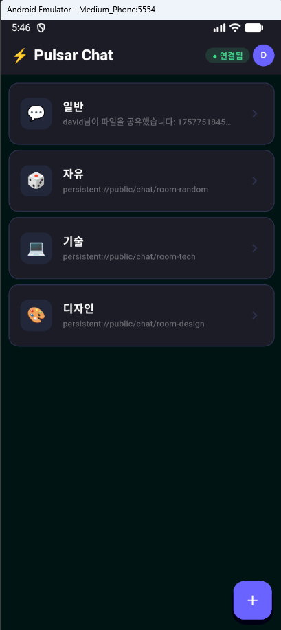</td>
    </tr>
    <tr>
      <td align="center"><b>07. 모바일 이미지 공유 화면</b><br/>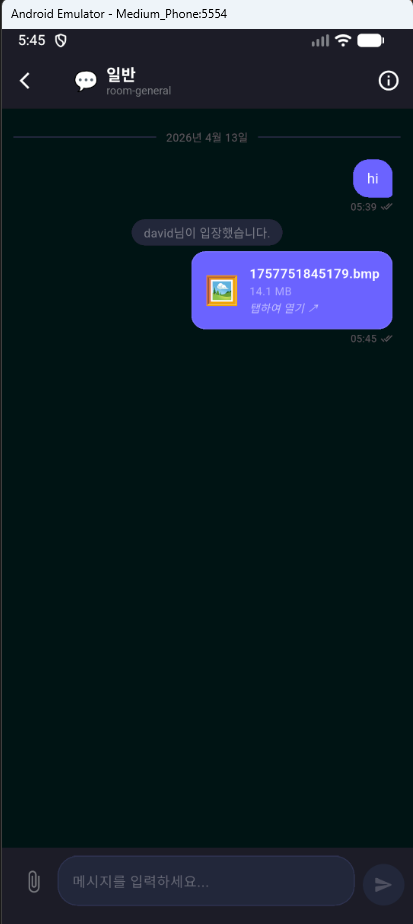</td>
      <td align="center"><b>08. MINIO 화면</b><br/>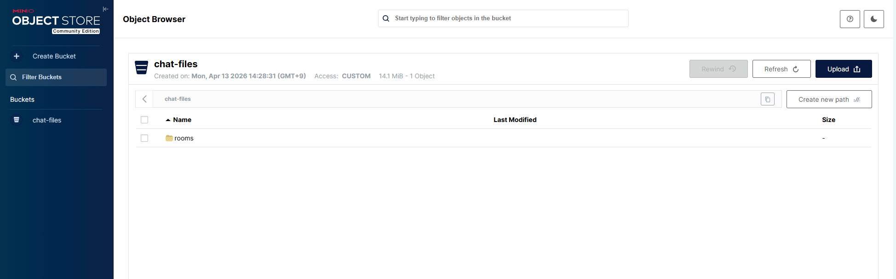</td>      
    </tr>
  </table>
</details>

## 시스템 아키텍처

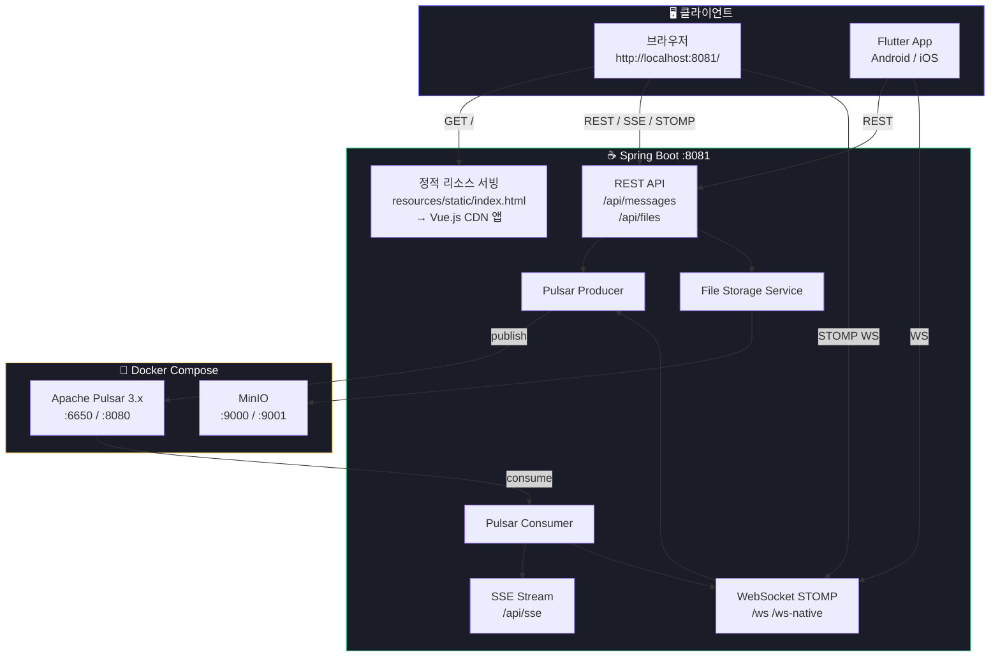

---

## 왜 Spring Boot가 Vue.js를 직접 서빙하나?

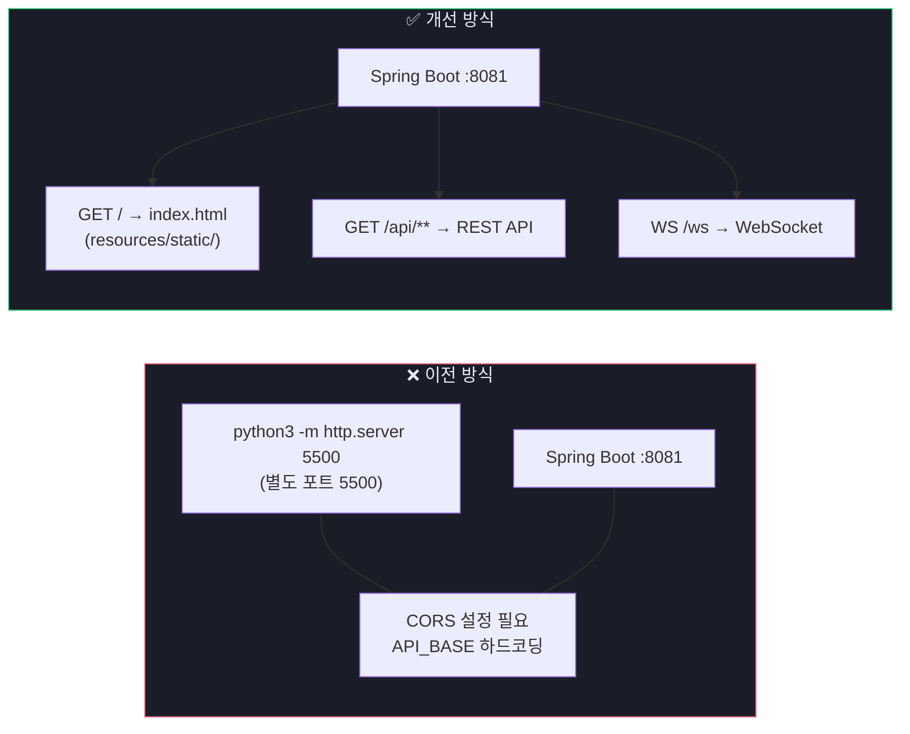

- **단일 포트(8081)** — 브라우저가 같은 오리진에서 API 호출 → CORS 불필요
- **`location.origin` 자동 참조** — 서버 IP/포트 하드코딩 없음
- **별도 프로세스 불필요** — `python3`, `nginx`, `serve` 전부 제거
- **Spring 정적 리소스 캐시** 정책 그대로 활용 가능

---

## 파일 구조 (변경 후)

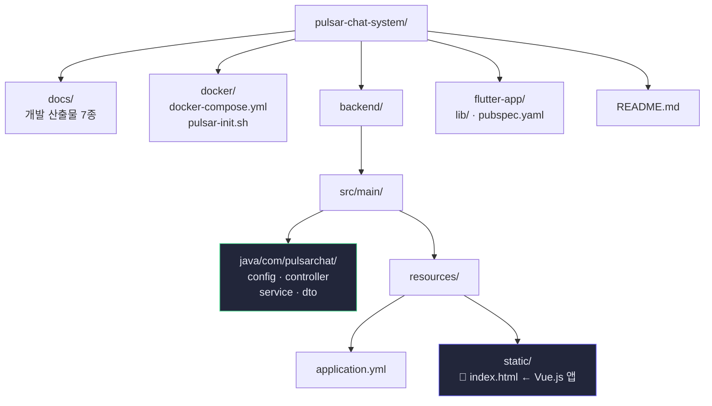

---

## 실행 순서

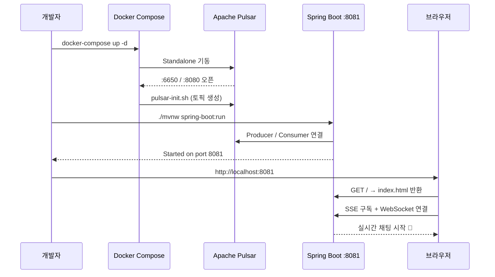

---

## 🔗 접속 정보

개발 및 테스트 시 아래 정보를 활용하세요.

| 서비스 | 주소 | 비고 |
|:---|-:---:|:---|
| **웹 채팅 인터페이스** | [http://localhost:8081](http://localhost:8081) | Vue.js 앱 (Spring 내장) |
| Pulsar Manager (UI) | [http://localhost:9527](http://localhost:9527) | admin / apachepulsar |
| **Pulsar Admin API** | [http://localhost:8085](http://localhost:8085) | REST API 전용 (UI 없음) |
| **MinIO Console** | [http://localhost:9001](http://localhost:9001) | 계정/비번: minioadmin / minioadmin123 |
| **Pulsar Binary URL** | `pulsar://localhost:6650` | 백엔드/클라이언트 연결용 |

---

## 빠른 시작

본 프로젝트는 두 가지 방식으로 실행할 수 있습니다.

### 방법 A. 전체 Docker 실행 (추천)
인프라와 백엔드를 모두 Docker 컨테이너로 실행합니다. 프로젝트 루트에서 다음을 실행하세요.
```bash
cd docker
docker-compose up -d --build
```

### 방법 B. 로컬 개발 실행 (Hybrid)
인프라만 Docker로 띄우고, 백엔드는 로컬 터미널에서 실행합니다. (코드 수정 및 디버깅 시 유리)
```bash
# 1. 인프라 기동 (Pulsar, MinIO)
cd docker
docker-compose up -d pulsar minio pulsar-manager minio-init

# 2. 백엔드 실행
cd ../backend
./mvnw spring-boot:run
```

### 3. 접속 확인
- 브라우저 주소: [http://localhost:8081](http://localhost:8081)


> **별도 프론트엔드 서버 불필요** — Spring Boot 하나만 실행하면 됩니다.

---

## Flutter 앱 실행

```bash
cd flutter-app
flutter pub get
flutter pub run build_runner build --delete-conflicting-outputs
flutter run
```

> Android 에뮬레이터 서버 주소: `http://10.0.2.2:8081`  
> 실제 기기: `http://{PC_로컬_IP}:8081`

---

> 상세 절차 및 트러블슈팅은 `docs/` 폴더 참조
