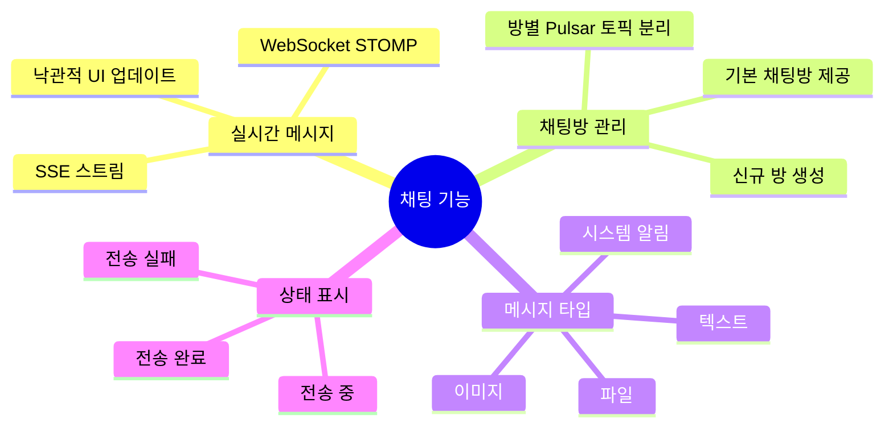

# 요구사항 정의서

**프로젝트명:** Pulsar Chat System  
**버전:** 1.0.0  
**작성일:** 2025-04-12  
**상태:** 확정

---

## 1. 프로젝트 개요

### 1.1 배경 및 목적

Apache Pulsar의 분산 메시징 성능을 활용하여 실시간 다중 유저 채팅 및 자료 공유 기능을 제공하는 시스템을 구축한다. 기존 HTTP 폴링 방식의 한계를 극복하고 Server-Sent Events / WebSocket 기반의 진정한 실시간 통신을 구현한다.

### 1.2 범위

| 구분 | 포함 여부 | 비고 |
|------|-----------|------|
| 실시간 채팅 (웹) | ✅ | Vue.js CDN |
| 실시간 채팅 (모바일) | ✅ | Flutter Android / iOS |
| 파일 / 이미지 공유 | ✅ | MinIO S3 |
| 사용자 인증 / 권한 | ❌ | v2 예정 |
| 메시지 영구 저장 DB | ❌ | v2 예정 |
| 관리자 대시보드 | ❌ | v2 예정 |

---

## 2. 이해관계자

| 역할 | 설명 |
|------|------|
| 개발팀 | 시스템 구현 및 유지보수 |
| 최종 사용자 | 웹/모바일 채팅 이용자 |
| 시스템 운영자 | Docker / Pulsar / MinIO 운영 |

---

## 3. 기능 요구사항

### 3.1 채팅 기능

#### FR-01 실시간 메시지 송수신
- 사용자는 채팅방에서 텍스트 메시지를 전송할 수 있다.
- 메시지는 Apache Pulsar Topic을 통해 브로드캐스트된다.
- 전송 후 SSE 또는 WebSocket을 통해 즉시 수신한다.

#### FR-02 채팅방 관리
- 기본 채팅방(일반, 자유, 기술)이 사전 생성된다.
- 사용자는 새로운 채팅방을 생성할 수 있다.
- 채팅방별로 독립적인 Pulsar Topic이 할당된다.

#### FR-03 파일 공유
- 사용자는 채팅방에서 파일을 첨부하여 공유할 수 있다.
- 지원 형식: 이미지, PDF, ZIP, 문서 (최대 50MB)
- 파일은 MinIO에 저장되고 Pre-signed URL로 제공된다.
- 이미지는 채팅 내 미리보기를 제공한다.

#### FR-04 사용자 프로필
- 최초 접속 시 닉네임 및 아바타 색상을 설정한다.
- 프로필 정보는 로컬(브라우저 / 앱)에 저장된다.

#### FR-05 모바일 앱 (Flutter)
- Android / iOS 모두 동작한다.
- 백그라운드 상태에서 FCM 푸시 알림을 수신한다.
- 오프라인 상태에서 기존 메시지를 Hive 캐시로 조회한다.

---

## 4. 비기능 요구사항

### 4.1 성능

| 항목 | 요구 수준 |
|------|-----------|
| 메시지 전파 지연 | 500ms 이하 |
| 동시 접속 사용자 | 100명 이상 |
| 파일 업로드 크기 | 최대 50MB |
| SSE 연결 유지 | 장시간 연결 (재연결 자동화) |

### 4.2 가용성 및 복구

| 항목 | 요구 수준 |
|------|-----------|
| SSE 자동 재연결 | 끊김 후 5초 내 재시도 |
| WebSocket 재연결 | 끊김 후 5초 내 재시도 |
| 메시지 재처리 | Dead Letter Topic 구성 (최대 3회) |
| Pulsar 데이터 보관 | Docker Volume으로 영속성 보장 |

### 4.3 보안

| 항목 | 요구 수준 |
|------|-----------|
| 파일 다운로드 | Pre-signed URL (1시간 유효) |
| CORS | 허용 도메인 명시 |
| 파일 크기 제한 | 서버/클라이언트 이중 검증 |

### 4.4 유지보수성

- Docker Compose 단일 명령으로 전체 인프라 기동
- 환경변수로 서버 설정 분리
- 구조화된 로깅 (JSON 포맷 지원)

---

## 5. 제약 사항

| 구분 | 내용 |
|------|------|
| 운영 환경 | WSL2 (Ubuntu 22.04) + Docker Desktop |
| 언어 | Java 17, Dart 3.x |
| 프레임워크 | Spring Boot 3.2, Flutter 3.x |
| 프론트엔드 빌드 도구 | 미사용 (CDN 방식) |
| DB | 별도 RDBMS 미사용 (v1) |

---

## 6. 용어 정의

| 용어 | 정의 |
|------|------|
| Topic | Pulsar에서 메시지를 분류하는 논리적 채널 |
| Producer | Pulsar Topic에 메시지를 발행하는 컴포넌트 |
| Consumer | Pulsar Topic을 구독하여 메시지를 수신하는 컴포넌트 |
| SSE | Server-Sent Events. 서버→클라이언트 단방향 스트림 |
| STOMP | Simple Text Oriented Messaging Protocol. WebSocket 위에서 동작 |
| DLQ | Dead Letter Queue. 처리 실패 메시지 보관 토픽 |
| Pre-signed URL | 일정 시간 동안 인증 없이 접근 가능한 서명된 URL |
