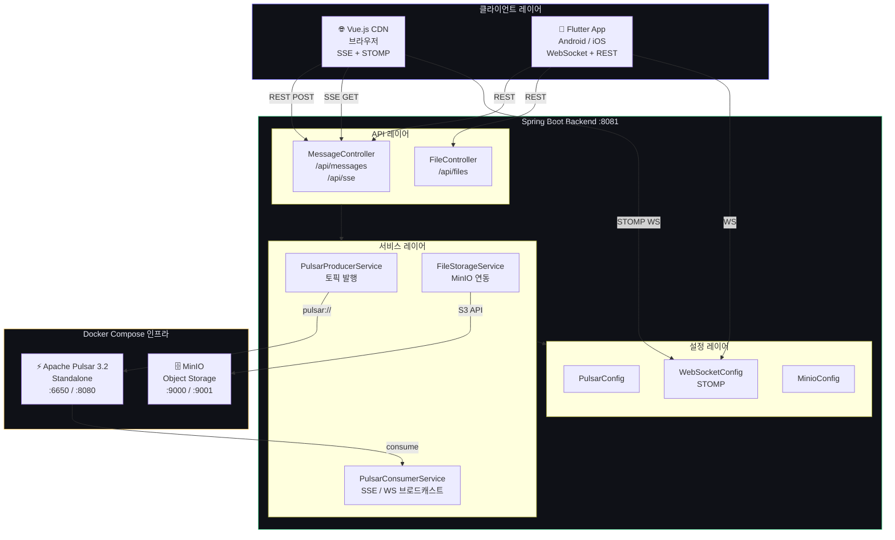
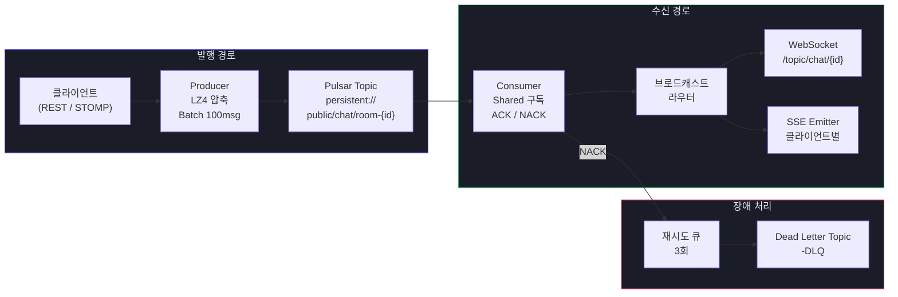
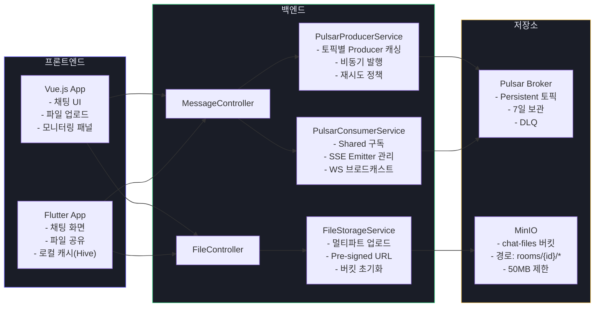
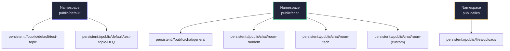
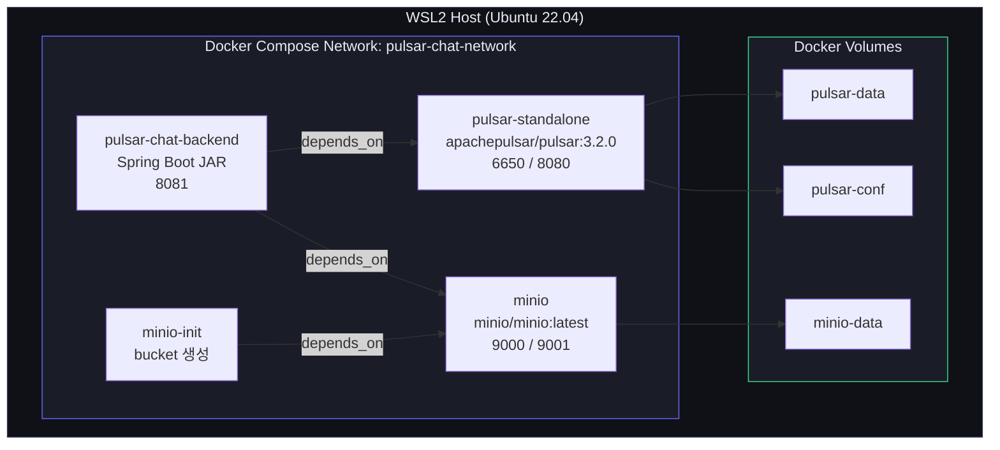

# 시스템 아키텍처 설계서

**프로젝트명:** Pulsar Chat System  
**버전:** 1.0.0  
**작성일:** 2025-04-12

---

## 1. 전체 시스템 구성도

---

## 2. 메시지 흐름 아키텍처

---

## 3. 컴포넌트 다이어그램

---

## 4. Pulsar 토픽 구조

---

## 5. 배포 구성도 (Docker Compose)

---

## 6. 기술 선택 근거

| 기술 | 선택 이유 | 대안 |
|------|-----------|------|
| Apache Pulsar | 토픽별 독립 파티션, Geo-replication, DLQ 지원 | Kafka, RabbitMQ |
| Spring Boot 3.x | Pulsar Spring 공식 지원, 풍부한 생태계 | Quarkus, Micronaut |
| SSE + STOMP 이중화 | SSE: 단방향 낮은 오버헤드 / STOMP: 양방향 채팅 | 순수 WebSocket |
| MinIO | S3 호환 로컬 환경, Docker 간편 구성 | AWS S3, GCS |
| Flutter | 단일 코드베이스 Android/iOS 지원 | React Native |
| Riverpod | 컴파일 타임 안전성, Provider 보다 테스트 용이 | BLoC, GetX |
| Hive | 순수 Dart, Flutter에 최적화된 경량 NoSQL | SQLite, Isar |
