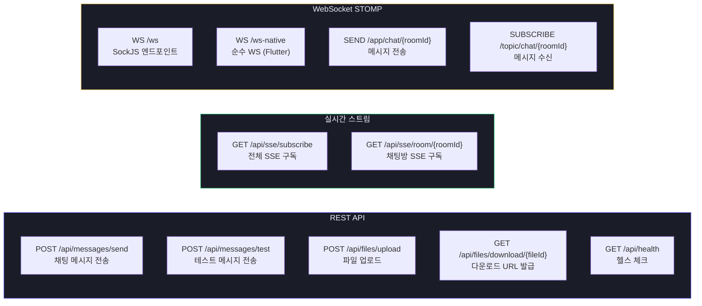
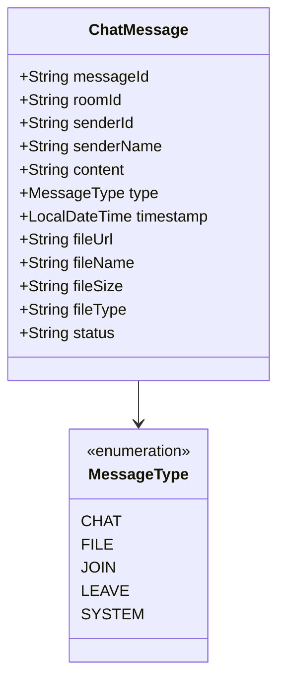

# API 명세서

**프로젝트명:** Pulsar Chat System  
**Base URL:** `http://localhost:8081`  
**버전:** 1.0.0  
**작성일:** 2025-04-12

---

## 1. API 구조 개요



---

## 2. 공통 응답 형식

```json
{
  "success": true,
  "message": "OK",
  "data": { },
  "timestamp": "2025-04-12T09:00:00"
}
```

| 필드 | 타입 | 설명 |
|------|------|------|
| success | boolean | 처리 성공 여부 |
| message | string | 결과 메시지 |
| data | object | 응답 데이터 |
| timestamp | datetime | 응답 시각 |

---

## 3. 메시지 API

### 3.1 채팅 메시지 전송

```
POST /api/messages/send
Content-Type: application/json
```

**Request Body**

| 필드 | 타입 | 필수 | 제약 | 설명 |
|------|------|------|------|------|
| roomId | string | ✅ | - | 채팅방 ID |
| senderId | string | ✅ | - | 발신자 ID |
| senderName | string | ✅ | - | 발신자 닉네임 |
| content | string | ✅ | 최대 1000자 | 메시지 내용 |
| type | enum | - | 기본: CHAT | CHAT / FILE / JOIN / LEAVE |

**Request 예시**
```json
{
  "roomId": "general",
  "senderId": "user-abc123",
  "senderName": "홍길동",
  "content": "안녕하세요!",
  "type": "CHAT"
}
```

**Response 예시**
```json
{
  "success": true,
  "message": "메시지가 발행되었습니다.",
  "data": {
    "messageId": "24:0:0:0",
    "roomId": "general"
  },
  "timestamp": "2025-04-12T09:00:00"
}
```

---

### 3.2 테스트 메시지 전송

```
POST /api/messages/test
Content-Type: application/json
```

**Request Body**

| 필드 | 타입 | 필수 | 설명 |
|------|------|------|------|
| senderId | string | - | 발신자 ID (기본: anonymous) |
| senderName | string | - | 닉네임 (기본: 테스터) |
| content | string | - | 내용 (기본: 테스트 메시지) |

---

## 4. SSE 구독 API

### 4.1 전체 메시지 SSE 구독

```
GET /api/sse/subscribe?clientId={clientId}
Accept: text/event-stream
```

| 파라미터 | 필수 | 설명 |
|----------|------|------|
| clientId | - | 클라이언트 식별자 (미입력 시 UUID 자동 생성) |

**이벤트 타입**

| 이벤트명 | 발생 시점 | 데이터 형식 |
|----------|-----------|-------------|
| connected | SSE 연결 직후 | `{"clientId": "...", "message": "SSE 연결 성공"}` |
| message | Pulsar 메시지 수신 시 | ChatMessage JSON |

---

### 4.2 채팅방 SSE 구독

```
GET /api/sse/room/{roomId}?clientId={clientId}
Accept: text/event-stream
```

| 파라미터 | 위치 | 필수 | 설명 |
|----------|------|------|------|
| roomId | path | ✅ | 채팅방 ID |
| clientId | query | - | 클라이언트 식별자 |

> 이 엔드포인트 호출 시 서버에서 자동으로 Pulsar 토픽 구독을 시작한다.

---

## 5. 파일 API

### 5.1 파일 업로드

```
POST /api/files/upload
Content-Type: multipart/form-data
```

**Form Data**

| 필드 | 타입 | 필수 | 제약 | 설명 |
|------|------|------|------|------|
| file | File | ✅ | 최대 50MB | 업로드 파일 |
| roomId | string | ✅ | - | 채팅방 ID |
| senderId | string | ✅ | - | 업로더 ID |
| senderName | string | ✅ | - | 업로더 닉네임 |

**Response 예시**
```json
{
  "success": true,
  "message": "파일이 업로드되었습니다.",
  "data": {
    "fileId": "rooms/general/f3a1b2c4-...-file.pdf",
    "fileUrl": "http://localhost:9000/chat-files/...?X-Amz-Signature=...",
    "fileName": "report.pdf",
    "fileSize": "2.3 MB",
    "fileType": "application/pdf"
  }
}
```

**오류 응답**

| HTTP 코드 | 상황 |
|-----------|------|
| 400 | 파일 없음 / 50MB 초과 |
| 500 | MinIO 저장 실패 |

---

### 5.2 파일 다운로드 URL 발급

```
GET /api/files/download/{fileId}
```

| 파라미터 | 위치 | 필수 | 설명 |
|----------|------|------|------|
| fileId | path | ✅ | URL 인코딩된 파일 ID |

**Response 예시**
```json
{
  "success": true,
  "message": "OK",
  "data": {
    "downloadUrl": "http://localhost:9000/chat-files/rooms/general/...?X-Amz-Expires=3600&...",
    "fileId": "rooms/general/f3a1b2c4-..."
  }
}
```

> Pre-signed URL 유효 기간: **1시간**

---

## 6. WebSocket STOMP

### 연결 엔드포인트

| 엔드포인트 | 프로토콜 | 대상 |
|------------|----------|------|
| `/ws` | SockJS | Vue.js 웹 브라우저 |
| `/ws-native` | 순수 WebSocket | Flutter 앱 |

### 메시지 전송 (SEND)

```
Destination: /app/chat/{roomId}
Body: ChatMessage JSON
```

### 메시지 수신 (SUBSCRIBE)

```
Destination: /topic/chat/{roomId}
```

**구독 예시 (JavaScript)**
```javascript
stompClient.subscribe('/topic/chat/general', (frame) => {
  const msg = JSON.parse(frame.body);
  console.log(msg.senderName, msg.content);
});
```

---

## 7. 헬스 체크

```
GET /api/health
```

**Response**
```json
{
  "success": true,
  "message": "OK",
  "data": {
    "status": "UP",
    "service": "pulsar-chat-backend"
  }
}
```

---

## 8. ChatMessage 스키마



| 필드 | 타입 | 설명 |
|------|------|------|
| messageId | string | UUID |
| roomId | string | 채팅방 ID |
| senderId | string | 발신자 ID |
| senderName | string | 닉네임 |
| content | string | 메시지 내용 |
| type | enum | 메시지 유형 |
| timestamp | datetime | `yyyy-MM-dd HH:mm:ss` |
| fileUrl | string | 파일 URL (FILE 타입) |
| fileName | string | 파일명 (FILE 타입) |
| fileSize | string | 파일 크기 문자열 |
| fileType | string | MIME 타입 |
| status | string | SENT / SENDING / FAILED |
