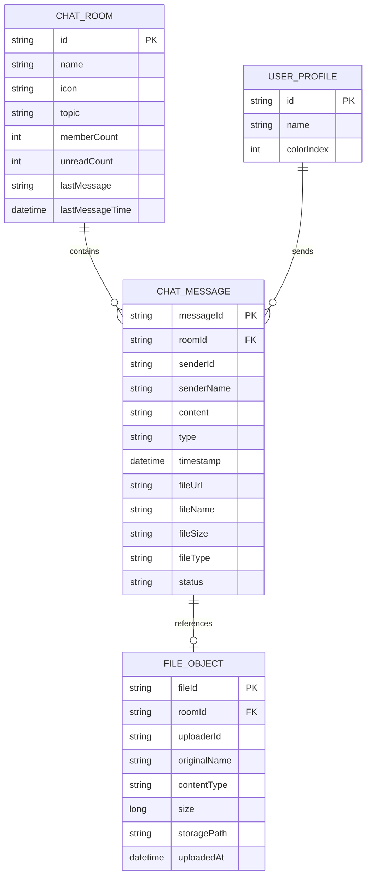
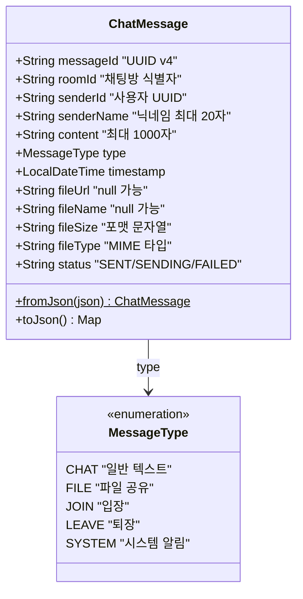
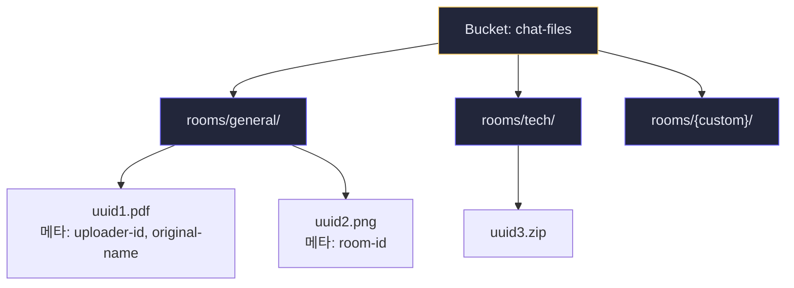
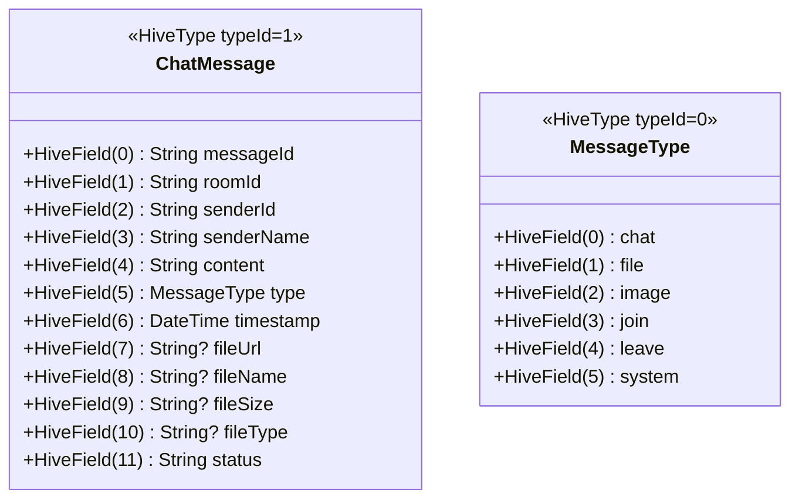
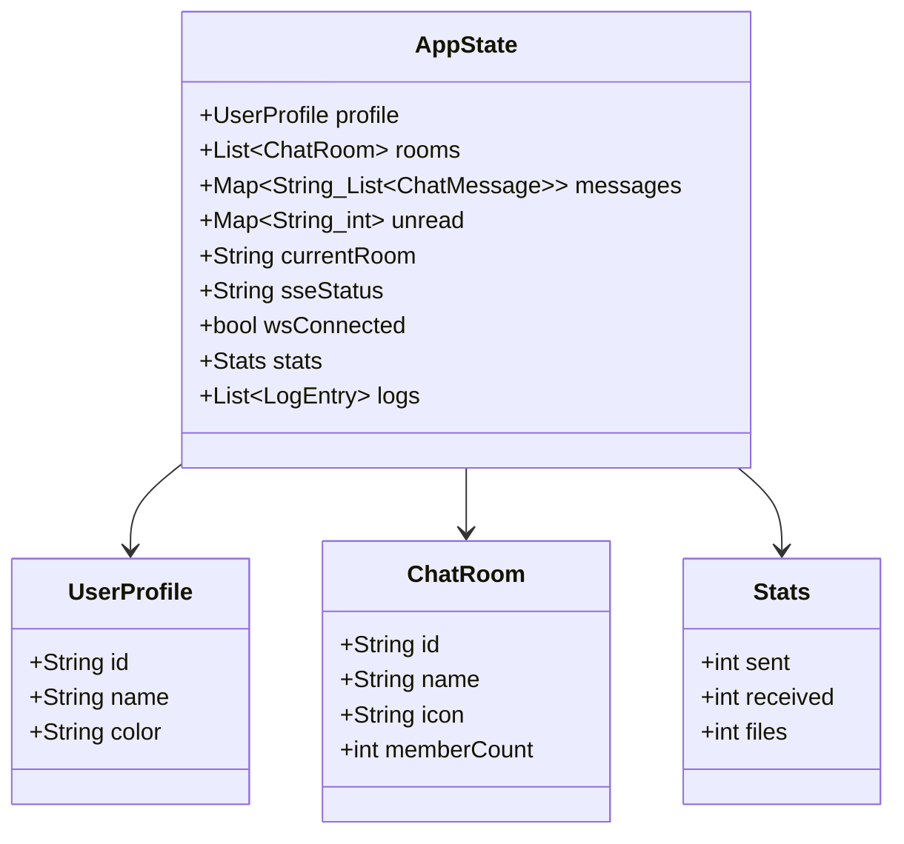
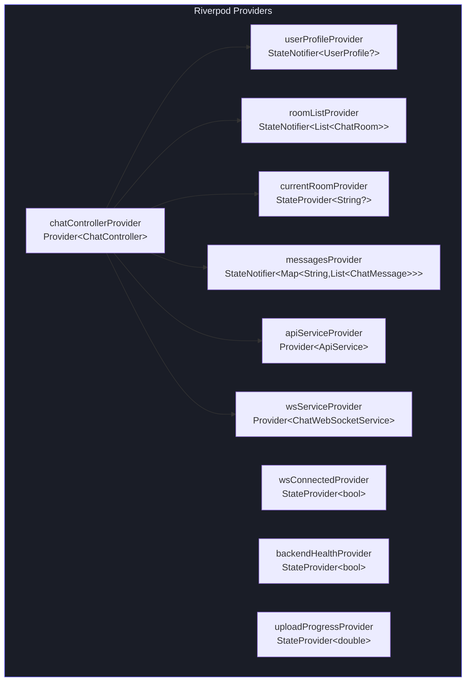
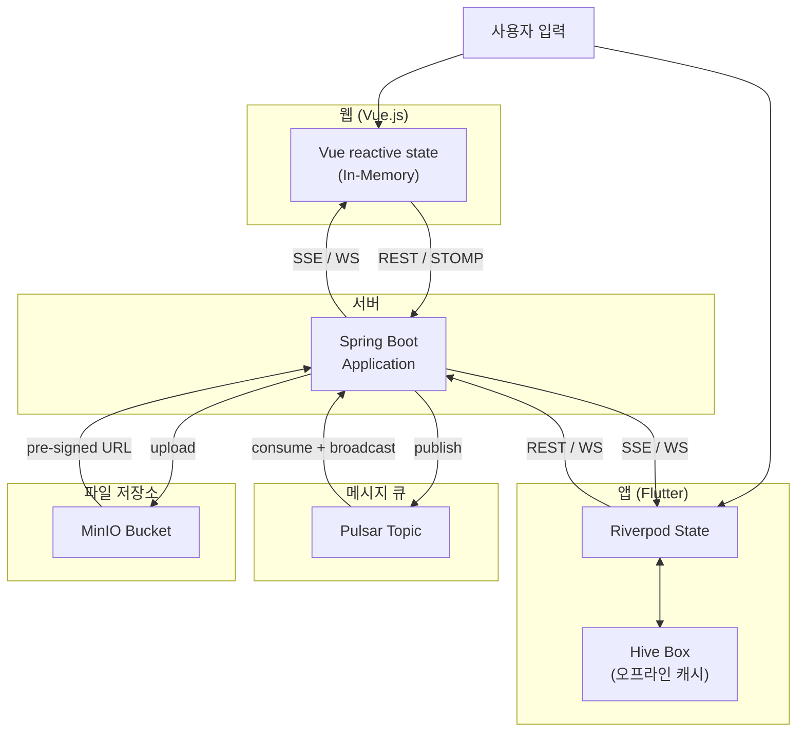

# 데이터 모델 정의서

**프로젝트명:** Pulsar Chat System  
**버전:** 1.0.0  
**작성일:** 2025-04-12

---

## 1. 전체 데이터 구조 개요



---

## 2. Pulsar 메시지 모델

### 2.1 ChatMessage (Pulsar Payload)



### 2.2 Pulsar 토픽 메타데이터

Pulsar 메시지 Property (헤더)에 포함되는 메타데이터:

| Property 키 | 값 예시 | 설명 |
|-------------|---------|------|
| messageType | CHAT | 메시지 유형 |
| senderId | user-abc123 | 발신자 ID |

---

## 3. MinIO 파일 저장 구조



**오브젝트 키 규칙:**

```
rooms/{roomId}/{UUID}{.확장자}
```

**오브젝트 사용자 메타데이터:**

| 키 | 값 |
|----|-----|
| uploader-id | 업로드한 사용자 ID |
| original-name | 원본 파일명 |
| room-id | 채팅방 ID |

---

## 4. Flutter 로컬 저장소 (Hive)

### 4.1 Box 구성

| Box 이름 | 타입 | 설명 |
|----------|------|------|
| `messages` | `Box<ChatMessage>` | 메시지 오프라인 캐시 |
| `settings` | `Box<dynamic>` | 사용자 프로필 설정 |

### 4.2 ChatMessage Hive Adapter



### 4.3 settings Box 키 목록

| 키 | 타입 | 설명 |
|----|------|------|
| `userId` | String | UUID v4 사용자 ID |
| `userName` | String | 닉네임 |
| `colorIndex` | int | 아바타 색상 인덱스 (0~11) |

---

## 5. Vue.js 상태 구조 (In-Memory)



---

## 6. Riverpod 상태 모델 (Flutter)



---

## 7. 데이터 흐름 요약


