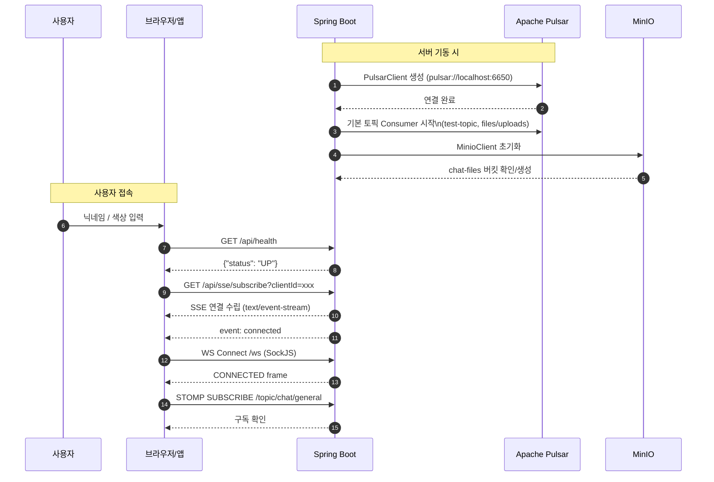
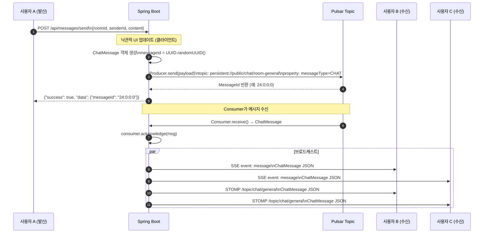
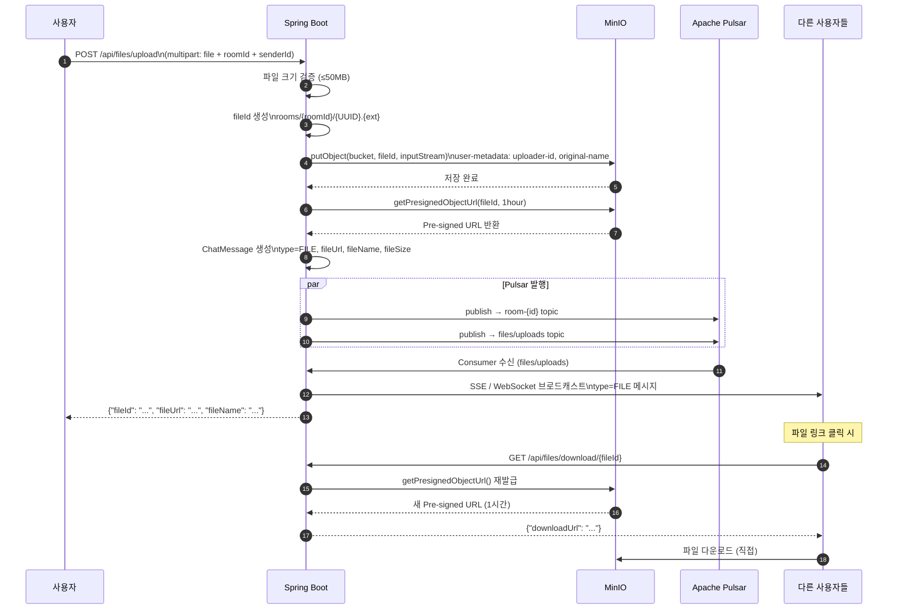
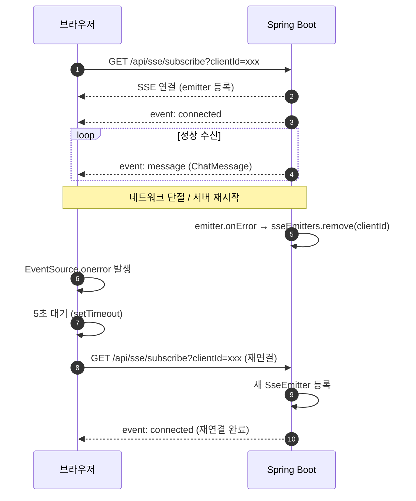
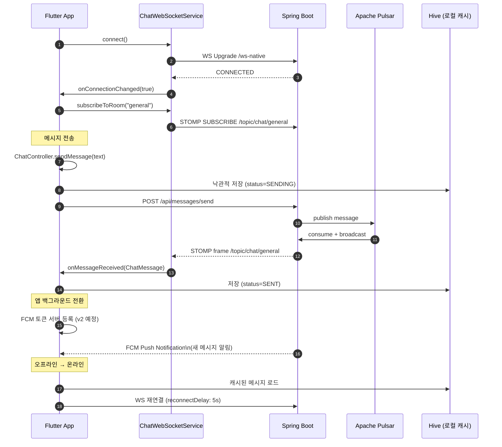
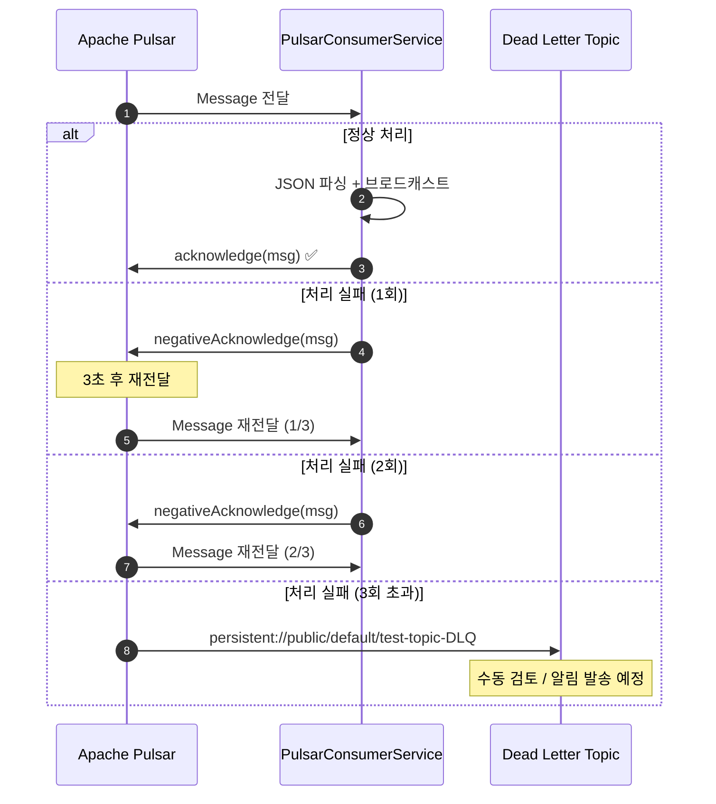

# 시퀀스 다이어그램

**프로젝트명:** Pulsar Chat System  
**버전:** 1.0.0  
**작성일:** 2025-04-12

---

## 1. 시스템 초기화 및 연결 수립

---

## 2. 텍스트 메시지 전송 흐름

---

## 3. 파일 업로드 및 공유 흐름

---

## 4. SSE 재연결 흐름

---

## 5. Flutter 앱 — WebSocket 연결 및 메시지 흐름

---

## 6. Dead Letter Queue (DLQ) 처리 흐름

