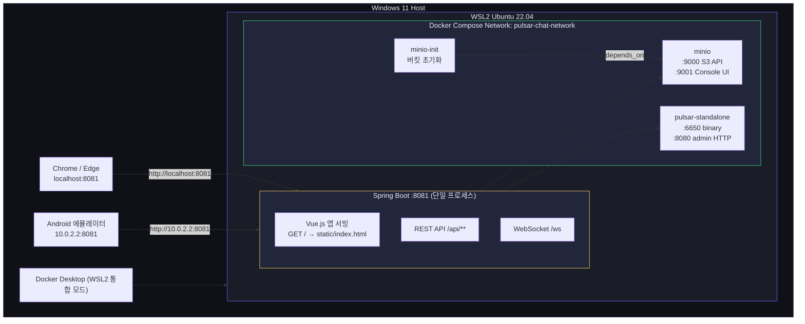
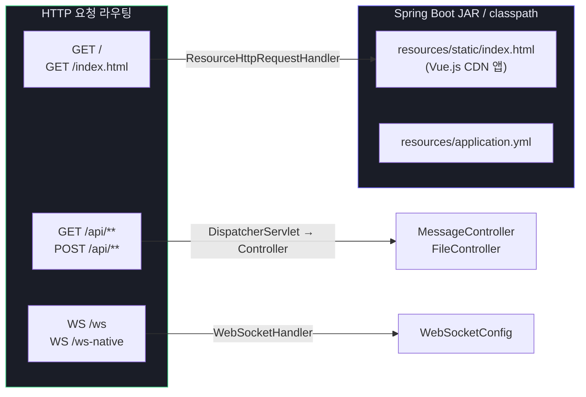
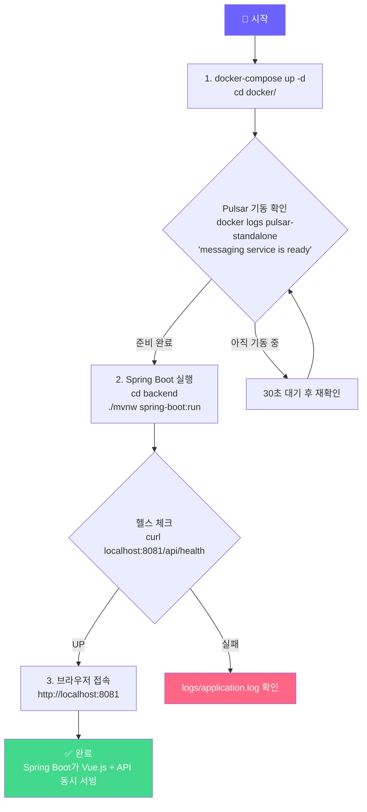

# 배포 및 운영 가이드

**프로젝트명:** Pulsar Chat System  
**버전:** 1.0.0  
**작성일:** 2025-04-12

---

## 1. 환경 구성도



---

## 2. 정적 리소스 서빙 원리



Spring Boot는 `src/main/resources/static/` 하위 파일을 **자동으로 정적 리소스로 서빙**한다.  
`application.yml`에서 캐시 주기만 명시하면 별도 설정 없이 동작한다.

```yaml
spring:
  web:
    resources:
      static-locations: classpath:/static/
      cache:
        period: 0   # 개발 중 캐시 비활성화 (운영 시 3600 권장)
```

---

## 3. 사전 준비

### 3.1 필수 소프트웨어

| 소프트웨어 | 버전 | 확인 명령 |
|------------|------|-----------|
| Docker Desktop | 4.x 이상 | `docker --version` |
| WSL2 (Ubuntu 22.04) | - | `wsl --list --verbose` |
| Java JDK | 17 이상 | `java -version` |
| Maven Wrapper | 3.8 이상 | `./mvnw -version` |
| Flutter (앱 빌드 시) | 3.x | `flutter --version` |

> `python3`, `nginx`, `serve` 등 별도 웹 서버 **불필요**

---

## 4. 단계별 실행 절차



---

## 5. 상세 실행 명령어

### 5.1 인프라 기동

```bash
cd pulsar-chat-system/docker/

# 전체 서비스 기동
docker-compose up -d

# 상태 확인
docker-compose ps

# Pulsar 준비 완료 대기
docker logs pulsar-standalone -f | grep "messaging service is ready"
```

### 5.2 Spring Boot 실행 (백엔드 + 프론트엔드 통합)

```bash
cd pulsar-chat-system/backend/

# 개발 모드 실행
./mvnw spring-boot:run

# 헬스 체크
curl http://localhost:8081/api/health

# 프론트엔드 접속 확인 (200 응답 여부)
curl -o /dev/null -s -w "%{http_code}" http://localhost:8081/
```

**접속 URL 정리:**

| 대상 | URL |
|------|-----|
| Vue.js 채팅 앱 | http://localhost:8081 |
| REST API | http://localhost:8081/api/health |
| MinIO Console | http://localhost:9001 |
| Pulsar Admin | http://localhost:8080/admin/v2/clusters |

### 5.3 Flutter 앱

```bash
cd pulsar-chat-system/flutter-app/

flutter pub get
flutter pub run build_runner build --delete-conflicting-outputs
flutter run
```

---

## 6. 환경 변수

| 변수명 | 기본값 | 설명 |
|--------|--------|------|
| `PULSAR_SERVICE_URL` | `pulsar://localhost:6650` | Pulsar 브로커 주소 |
| `MINIO_ENDPOINT` | `http://localhost:9000` | MinIO API 엔드포인트 |
| `MINIO_ACCESS_KEY` | `minioadmin` | MinIO 액세스 키 |
| `MINIO_SECRET_KEY` | `minioadmin123` | MinIO 시크릿 키 |
| `MINIO_BUCKET` | `chat-files` | 파일 저장 버킷명 |

---

## 7. WSL2 포트 포워딩

```powershell
# PowerShell (관리자 권한)
$wslIP = (wsl hostname -I).Trim()

# 포트 포워딩 (Spring Boot 하나만 있으면 됨)
netsh interface portproxy add v4tov4 listenport=8081 connectport=8081 connectaddress=$wslIP
netsh interface portproxy add v4tov4 listenport=9001 connectport=9001 connectaddress=$wslIP

New-NetFireWallRule -DisplayName "WSL2 Pulsar Chat" `
  -Direction Inbound -Action Allow -Protocol TCP `
  -LocalPort @(8081, 9001)
```

---

## 8. 종료

```bash
# Docker 서비스 중지
cd docker/ && docker-compose down

# Spring Boot 종료
Ctrl + C
```
