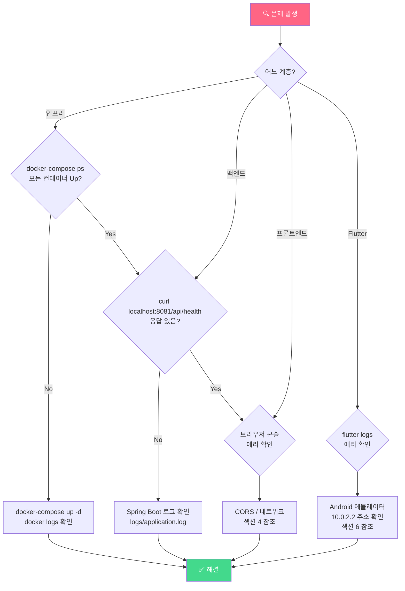
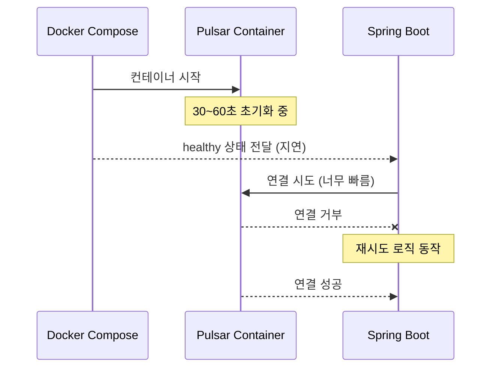
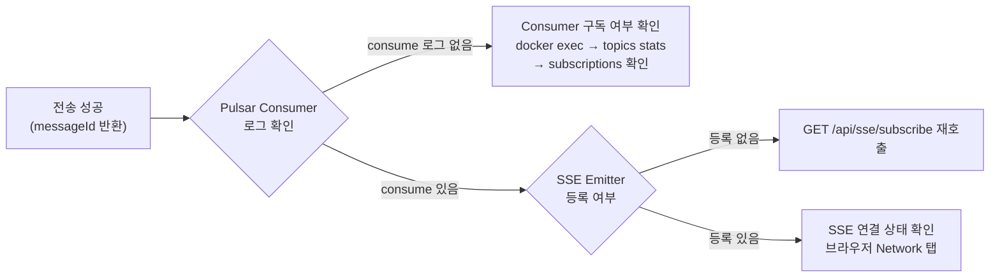
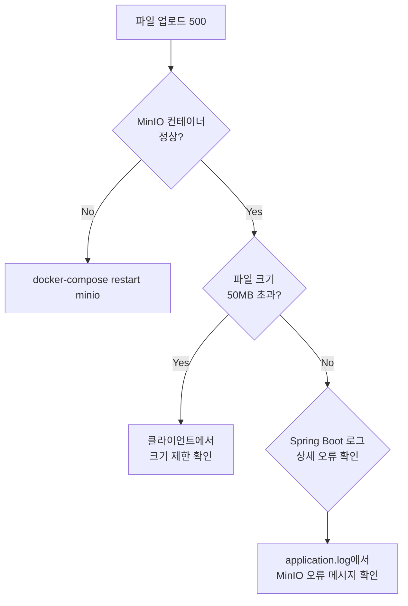
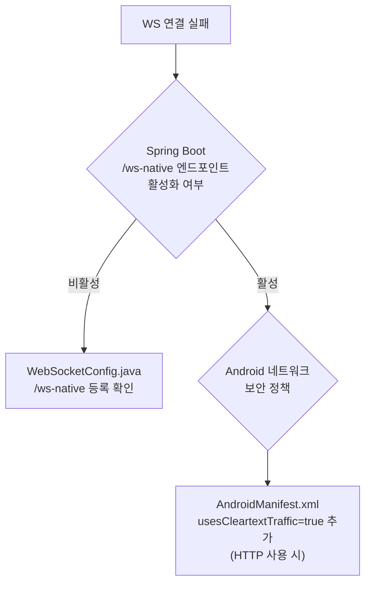

# 트러블슈팅 가이드

**프로젝트명:** Pulsar Chat System  
**버전:** 1.0.0  
**작성일:** 2025-04-12

---

## 1. 문제 진단 흐름도



---

## 2. Pulsar 관련 문제

### 2.1 Pulsar 기동 지연 (가장 흔한 문제)

**증상:** Spring Boot 시작 시 `PulsarClientException: Lookup failed` 오류

**원인:** Pulsar Standalone 기동에 30~60초 소요



**해결:**

```bash
# Pulsar가 완전히 기동될 때까지 대기
docker logs pulsar-standalone -f | grep "messaging service is ready"
# 아래 메시지 확인 후 Spring Boot 실행
# "messaging service is ready - number of topics loaded ..."

# 또는 헬스체크 수동 확인
curl http://localhost:8080/admin/v2/clusters
```

---

### 2.2 토픽 생성 실패

**증상:** `TopicNotFoundException` 또는 토픽이 자동 생성되지 않음

**해결:**

```bash
docker exec -it pulsar-standalone bash

# 네임스페이스 존재 확인
bin/pulsar-admin namespaces list public

# 토픽 수동 생성
bin/pulsar-admin topics create persistent://public/chat/room-general
bin/pulsar-admin topics create persistent://public/chat/room-random
bin/pulsar-admin topics create persistent://public/chat/room-tech

# 자동 토픽 생성 정책 허용
bin/pulsar-admin namespaces set-auto-topic-creation public/chat \
  --enable --type non-partitioned
```

---

### 2.3 메시지가 수신되지 않음

**증상:** 전송은 성공하나 SSE/WebSocket으로 메시지가 오지 않음

**진단 흐름:**



```bash
# 구독 목록 확인
docker exec -it pulsar-standalone \
  bin/pulsar-admin topics subscriptions persistent://public/chat/room-general

# 미처리 메시지 수 확인 (backlog)
docker exec -it pulsar-standalone \
  bin/pulsar-admin topics stats persistent://public/chat/room-general \
  | grep msgBacklog
```

---

### 2.4 DLQ 메시지 적재

**증상:** 메시지 처리 실패 반복 → DLQ 토픽에 메시지 쌓임

```bash
# DLQ 메시지 수 확인
docker exec -it pulsar-standalone \
  bin/pulsar-admin topics stats persistent://public/default/test-topic-DLQ

# DLQ 메시지 내용 확인 (consume)
docker exec -it pulsar-standalone \
  bin/pulsar-client consume persistent://public/default/test-topic-DLQ \
  -s dlq-reader -n 10
```

---

## 3. MinIO 관련 문제

### 3.1 버킷 없음 오류

**증상:** `NoSuchBucketException: chat-files`

```bash
# minio-init 컨테이너 재실행
docker-compose restart minio-init

# 수동 버킷 생성
docker exec -it minio bash
mc alias set local http://localhost:9000 minioadmin minioadmin123
mc mb local/chat-files
mc anonymous set download local/chat-files
```

---

### 3.2 파일 업로드 실패

**증상:** `POST /api/files/upload` → 500 오류

**체크리스트:**



---

## 4. Spring Boot 관련 문제

### 4.1 포트 충돌 (8081)

**증상:** `Port 8081 was already in use`

```bash
# 포트 사용 프로세스 확인
lsof -ti:8081
# 또는
ss -tlnp | grep 8081

# 프로세스 종료
kill -9 $(lsof -ti:8081)
```

---

### 4.2 CORS 오류

**증상:** 브라우저에서 `Access-Control-Allow-Origin` 오류

**확인:**

```javascript
// 브라우저 콘솔에서 확인
// "CORS policy: No 'Access-Control-Allow-Origin' header"
```

**해결:** `application.yml` 수정

```yaml
app:
  cors:
    allowed-origins:
      - "http://localhost:5500"
      - "http://127.0.0.1:5500"
      - "http://localhost:3000"
      - "*"   # 개발 환경에서만 사용
```

---

### 4.3 SSE 연결이 즉시 끊김

**증상:** SSE 연결 후 바로 종료, 재연결 루프

**원인:** 일부 리버스 프록시 / Nginx가 SSE 버퍼링

**해결:** Spring Boot 직접 접근 확인 (프록시 우회)

```bash
# SSE 직접 테스트
curl -N http://localhost:8081/api/sse/subscribe?clientId=test
# 출력이 계속 유지되어야 정상
```

---

## 5. Vue.js 프론트엔드 문제

### 5.1 메시지 중복 표시

**증상:** 같은 메시지가 2번 보임

**원인:** SSE와 STOMP 이중 구독으로 중복 수신

**해결:** `messageId` 기반 중복 제거 로직 동작 확인

```javascript
// index.html의 handleIncomingMessage 함수 확인
const exists = messages.value[roomId].some(m => m.messageId === msg.messageId);
if (!exists) { /* 추가 */ }
```

---

### 5.2 파일 업로드 후 미리보기 안 됨

**증상:** 이미지 공유 후 미리보기 미표시

**원인:** Pre-signed URL의 MinIO 호스트가 `minio` (컨테이너명)로 반환될 경우

**해결:** MinIO 클라이언트 초기화 시 외부 접근 주소 사용 확인

```yaml
# application.yml
minio:
  endpoint: http://localhost:9000  # 컨테이너명(minio) 사용 금지
```

---

## 6. Flutter 앱 문제

### 6.1 Android 에뮬레이터에서 서버 연결 실패

**증상:** `SocketException: Connection refused`

**원인:** 에뮬레이터에서 `localhost`는 에뮬레이터 자신을 가리킴

```dart
// 잘못된 설정
static const String _baseUrl = 'http://localhost:8081/api';  // ❌

// 올바른 설정 (Android 에뮬레이터)
static const String _baseUrl = 'http://10.0.2.2:8081/api';  // ✅

// 실제 기기 (PC와 같은 Wi-Fi)
static const String _baseUrl = 'http://192.168.1.XXX:8081/api';  // ✅
```

---

### 6.2 Hive 초기화 오류

**증상:** `HiveError: Box not found`

**해결:**

```bash
# 앱 데이터 초기화 후 재실행
flutter clean
flutter pub get
flutter pub run build_runner build --delete-conflicting-outputs
flutter run
```

---

### 6.3 WebSocket 연결 실패 (Flutter)

**증상:** STOMP 연결 후 즉시 끊김

**진단:**



`android/app/src/main/AndroidManifest.xml`:

```xml
<application
    android:usesCleartextTraffic="true"
    ...>
```

---

## 7. Docker 공통 문제

### 7.1 디스크 공간 부족

```bash
# Docker 디스크 사용량 확인
docker system df

# 미사용 리소스 정리
docker system prune -f

# 볼륨 포함 전체 정리 (주의: 데이터 삭제)
docker system prune -a --volumes
```

### 7.2 컨테이너 재시작 후 데이터 유실

**원인:** 볼륨 마운트 미설정

**확인:**

```bash
# 볼륨 목록
docker volume ls | grep pulsar

# 볼륨 상세
docker volume inspect docker_pulsar-data
```

**정상 상태:** `docker-compose.yml`의 `pulsar-data`, `minio-data` 볼륨이 마운트되어 있어야 함

---

## 8. 로그 수집 체크리스트

문제 보고 시 아래 로그를 함께 첨부:

```bash
# 1. Docker 컨테이너 상태
docker-compose ps

# 2. Pulsar 로그 (최근 50줄)
docker logs pulsar-standalone --tail 50

# 3. MinIO 로그
docker logs minio --tail 20

# 4. Spring Boot 로그
tail -100 backend/logs/application.log

# 5. 네트워크 연결 확인
curl -v http://localhost:8081/api/health
curl -v http://localhost:8080/admin/v2/clusters
curl -v http://localhost:9000/minio/health/live
```
